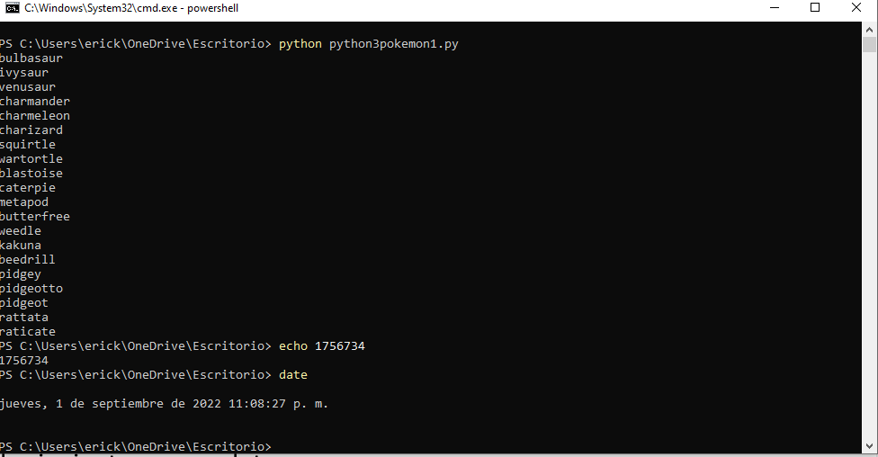
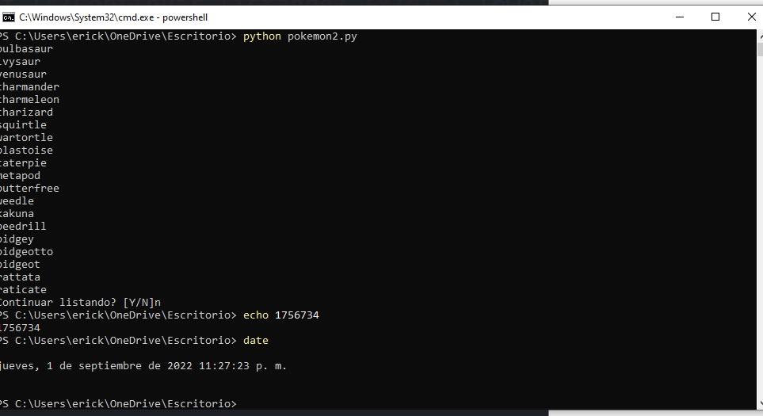
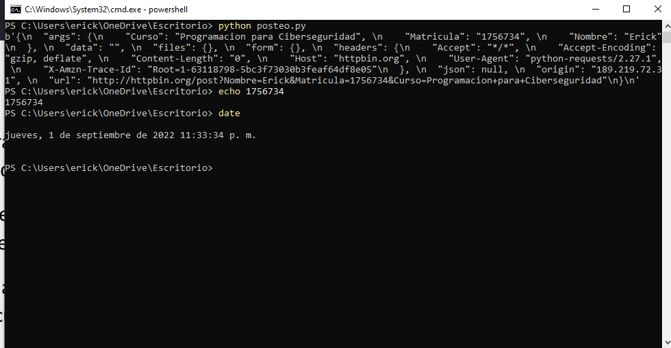

# Manejo de APIs

#### En esta seccion veremos como utilizar el software de Postman para consumir APIs, las cuales nos ayudan a realizar tareas especificas que nos facilitan a la hora de construir o manejar nuestro propio software. Con Python de nuestro lado, consumiremos la API de Pokemon.
### 1. Pokemon1

``` python
import requests
#Erick Daniel Blanco De La Garza
#Matricula: 1756734
if __name__ == '__main__':
	url = 'http://pokeapi.co/api/v2-from/'

	response = requests.get(url)
	payload = response.json()
	results = payload.get('results', [])

	if results:
		for pokemon in results:
			name = pokemon['name']
			print(name)

```


#
#
---
### 2. Pokemon2
``` python
import requests
#Erick Daniel Blanco De La Garza
#Matricula: 1756734
def get_pokemons (url = 'http://pokeapi.co/api/v2-from/', offset=0):
if __name__ == '__main__':
	args = {'offset':offset} if offset else {}

	response = requests(url, params=args)
	payload = response.json()
	results = payload.get('results', [])

	if results:
		for pokemon in results:
			name = pokemon['name']
			print(name)
	next = input ("¿Continuar listando [Y/N]").lower()
	if next == 'y':
		get_pokemons(offset=offset+20)
if __name__ == '__main__':
	url = 'http://pokeapi.co/api/v2-from/'
	get_pokemons()
```

#
#
---
### 3. Posteo
``` python
import requests
import json
#Erick Daniel Blanco De La Garza
#Matricula: 1756734
if __name__ == '__main__':
	url = 'http://httpbin.org/post'
	argumentos = {'Nombre':'Erick','Matricula':'1756734', 'Curso':'Programacion para Ciberseguridad'}

	response = requests.post(url, params=argumentos)
	if response.status_code == 200:
		print(response.content)
```

 #
[Subir](#top)

---

#   