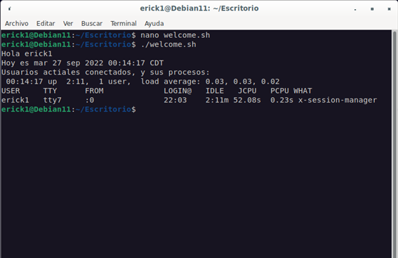
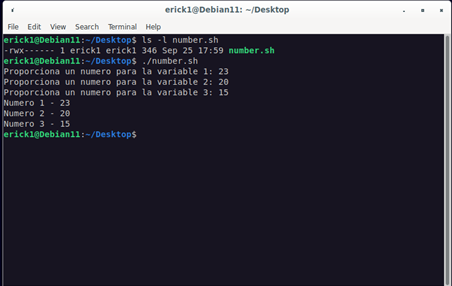
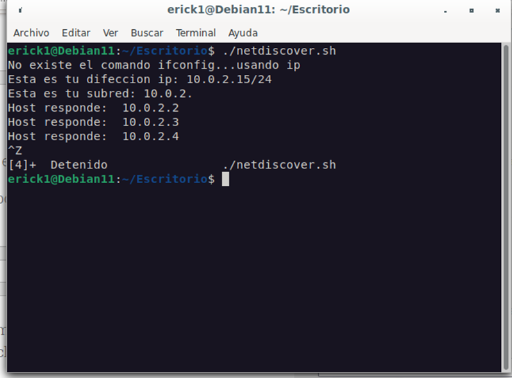
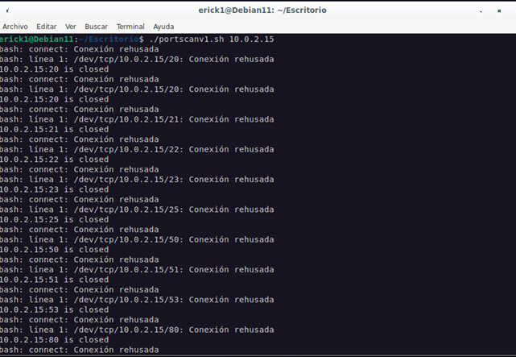
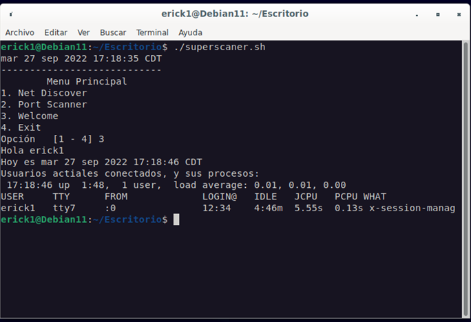

#Scripting en Bash
#
__*Los siguientes scripts están hechos en Bash y son herramientas que nos permitiran revisar algunas caracteristicas principales de Bash, como lo puede ser el entender y manejar las variables; tanto creadas por nosotros mismos o por el sistema, utilizaremos algunas estructuras de control como son los condicionales y tambien estructuras repetitivas como lo son los ciclos que están dispoibles en Linux. En estos scripts revisaremos que puertos están abiertos o cerrados dentro de nuestra maquina.*__

### 1. welcome
##### Imprimiendo algunas variables del sistema en Bash

```bash
#!/bin/bash
#Erick Daniel Blanco De La Garza
#1756734
#
echo "Hola ${LOGNAME}"
echo "Hoy es $(date)"
echo "Usuarios actiales conectados, y sus procesos: "
w
```


### 2. number
##### Lectura e impresion de variables en Bash
```bash
#!/bin/bash
#Erick Daniel Blanco De La Garza
#1756734
#Leer 3 numeros asignados a 3 variables
read -p "Proporciona un numero para la variable 1: " n1
read -p "Proporciona un numero para la variable 2: " n2
read -p "Proporciona un numero para la variable 3: " n3
#
#DEspliega los 3 numeros proporcionados por el usuario
echo "Numero 1 - $n1"
echo "Numero 2 - $n2"
echo "Numero 3 - $n3"
```


###4. netdiscover
##### Con este script vizualizamos los detalles de nuestra red y visualiar los usuarios actuales conectados junto con sus procesos
```bash
#!/bin/bash
#Erick Daniel Blanco De La Garza
#1756734
#Escaner de red basico en BASH
#Determinando el segmento de red
which ifconfig && { echo "Comando ifconfig existe...";
	            direccion_ip=`ifconfig |grep inet |grep -v "127.0.0.1" |awk '{ print $2}'`;
		    echo "Esta es tu difeccion ip: "$direccion_ip;
		    subred=`ifconfig |grep inet |grep -v "127.0.0.1" |awk '{ print $2}'|awk -F. '{print $1"."$2"."$3"."}'`;
		    echo "Esta es tu subred: "$subred;
                    }\
		|| { echo "No existe el comando ifconfig...usando ip";
                    direccion_ip=`ip addr show |grep inet -w |grep -v "127.0.0.1" |awk '{ print $2}'`;
                    echo "Esta es tu difeccion ip: "$direccion_ip;
                    subred=`ip addr show |grep inet -w |grep -v "127.0.0.1" |awk '{ print $2}'| awk -F. '{print $1"."$2"."$3"."}'`;
                    echo "Esta es tu subred: "$subred;
		    }
for ip in {1..254}
do
    ping -q -c 4 ${subred}${ip} > /dev/null
    if [ $? -eq 0 ]
    then
	echo "Host responde: " ${subred}${ip}
    fi
done

```


###5. portscanv1
##### Con este script vizualizamos los puertos que tenemos abiertos en nuestro equipo Linux
``` bash
#!/bin/bash
#Escaner de puertos usando archivo especial en /dev
#escrito en bash
#Erick Daniel Blanco De La Garza
#1756734
#Definicion de variables
direccion_ip=$1
puertos="20,20,21,22,23,25,50,51,53,80,110,119,135,136,137,138,139,143,161,162,389,443,445,636,1025,1443,3389,5985,5986,8080,10000"
#verificando que cada parametro ip no venga vacio
[ $# -eq 0 ] && { echo "Modo de uso: $0 {$ip1}"; exit 1; }
#
#Bucle for para cada puerto en $puertos
#
IFS=,
for port in $puertos
do
    timeout 1 bash -c "echo > /dev/tcp/$direccion_ip/$port > /dev/null 2>&1" &&\
    echo $direccion_ip":"$port" is open"\
    ||\
    echo $direccion_ip":"$port" is closed"
done
```

###6. superscan
##### Con este script juntamos algunos de los scripts anteriores para realizar las tareas desde un solo script de una manera mas ordenada
``` bash
#!/bin/bash
#Erick Daniel Blanco De La Garza
#1756734
#Ejemplo de menu en BASH
#
date
    echo "----------------------------"
    echo "	Menu Principal"
    echo "1. Net Discover"
    echo "2. Port Scanner"
    echo "3. Welcome"
    echo "4. Exit"
read -p "Opción   [1 - 4] " c
ip1=$(ip addr show |grep inet -w |grep -v "127.0.0.1" |awk '{ print $2}')

case $c in
	1) /<path>/netdiscover.sh;;
	2) /<path>/portscanv1.sh ${ip1};;
	3) /<path>/welcome.sh;;
	4) echo "Bye!"; exit 0;;
esac
```

[Subir](#top)