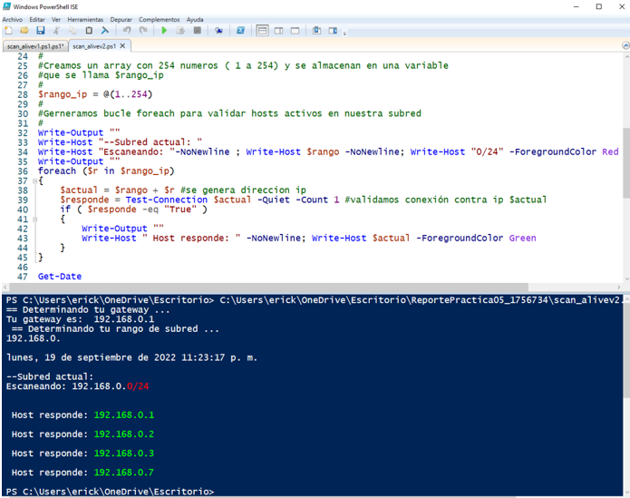
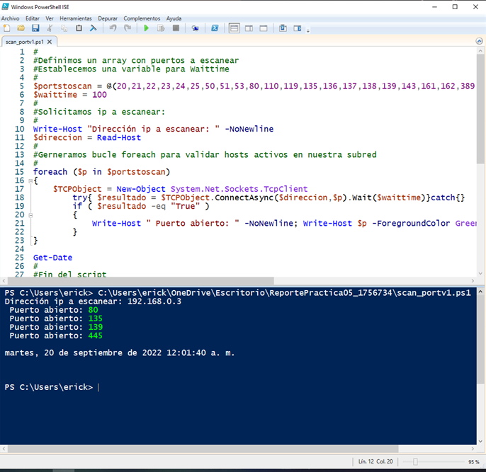

# Scripting en Powershell  
#
__*Los siguientes scripts están hechos en Powershell y son herramientas que nos permitiran revisar información dentro de nuestro quipo Windows. Analizaremos ciertas centencias y estructuras como lo son los condicionales, ciclos de repetición y arreglos. Revisaremos los puertos que están abiertos o cerrados y alguna información de la red con un escaneo basico dentro de nuestra maquina.*__
### 2. scan_alivev2
##### Script en powershell para escanear la red en nuestro equipo windows 
```powershell
#Nombre: Erick Daniel Blanco De La Garza
#Matricula: 1756734
#Escaneo de equipos activos en la subred
#Conociendo el gateway
$subred = (Get-NetRoute -DestinationPrefix 0.0.0.0/0).NextHop
Write-Host "== Determinando tu gateway ..."
Write-Host "Tu gateway es: "$subred
#
#Determinando rango de subred
#
$rango = $subred.Substring(0,$subred.IndexOf('.') + 1 + $subred.Substring($subred.IndexOf('.') + 1).IndexOf('.') +3)
Write-Host " == Determinando tu rango de subred ..."
echo $rango
Get-Date
#
#Determinando si #rango termina en "."
#En ocaciones el rango de subred no termina en punto, necesitamos formarlo
#
$punto = $rango.EndsWith('.')
if($punto -like "False" )
{
    $rango = $rango + '.' #agregamos el punto en caso de que no estuviera
}
#
#Creamos un array con 254 numeros ( 1 a 254) y se almacenan en una variable
#que se llama $rango_ip
#
$rango_ip = @(1..254)
#
#Gerneramos bucle foreach para validar hosts activos en nuestra subred
#
Write-Output ""
Write-Host "--Subred actual: "
Write-Host "Escaneando: "-NoNewline ; Write-Host $rango -NoNewline; Write-Host "0/24" -ForegroundColor Red
Write-Output ""
foreach ($r in $rango_ip)
{
    $actual = $rango + $r #se genera direccion ip
    $responde = Test-Connection $actual -Quiet -Count 1 #validamos conexión contra ip $actual
    if ( $responde -eq "True" )
    {
        Write-Output ""
        Write-Host " Host responde: " -NoNewline; Write-Host $actual -ForegroundColor Green
    }
}

Get-Date
#
#Fin del script
#
```


---

### 1. scan_portv2
##### Script en powershell para  revisar los puertos que están abiertos en nuestro equipo windows 
```powershell
#Nombre: Erick Daniel Blanco De La Garza
#Matricula: 1756734
#Definimos un array con puertos a escanear
#Establecemos una variable para Waittime
#
$portstoscan = @(20,21,22,23,24,25,50,51,53,80,110,119,135,136,137,138,139,143,161,162,389,443,445,636,1025,1443,3389,5985,5985,8080,1000)
$waittime = 100
#
#Solicitamos ip a escanear:
#
Write-Host "Dirección ip a escanear: " -NoNewline
$direccion = Read-Host
#
#Gerneramos bucle foreach para validar hosts activos en nuestra subred
#
foreach ($p in $portstoscan)
{
    $TCPObject = New-Object System.Net.Sockets.TcpClient
        try{ $resultado = $TCPObject.ConnectAsync($direccion,$p).Wait($waittime)}catch{}
        if ( $resultado -eq "True" )
        {
            Write-Host " Puerto abierto: " -NoNewline; Write-Host $p -ForegroundColor Green
        }
}

Get-Date
#
#Fin del script
```


[Subir](#top)